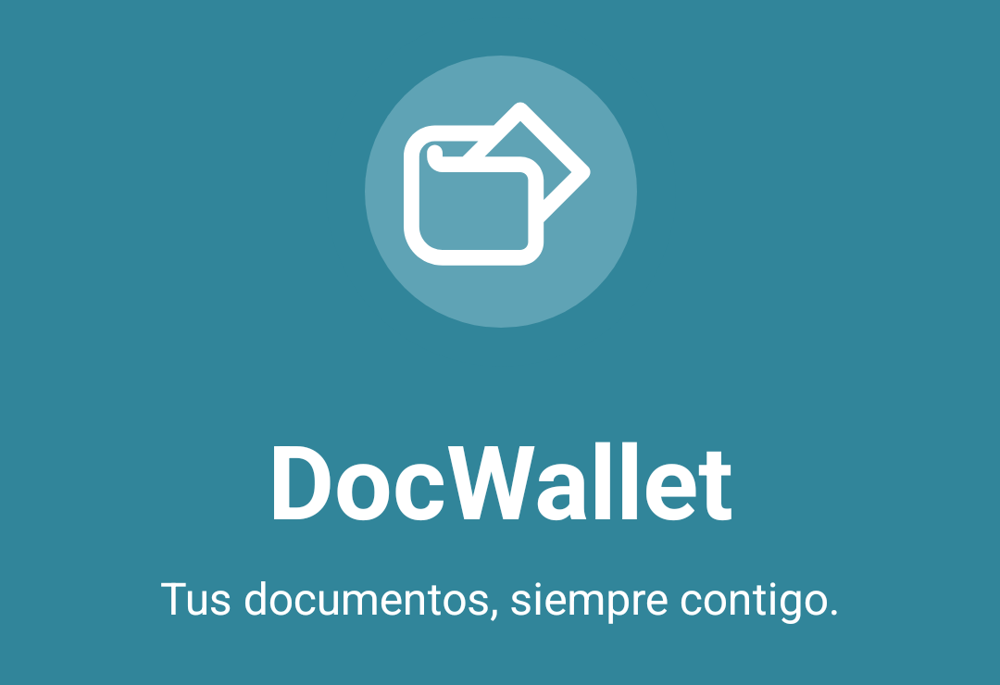
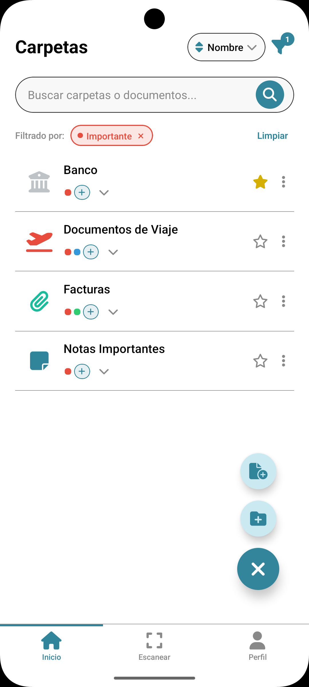
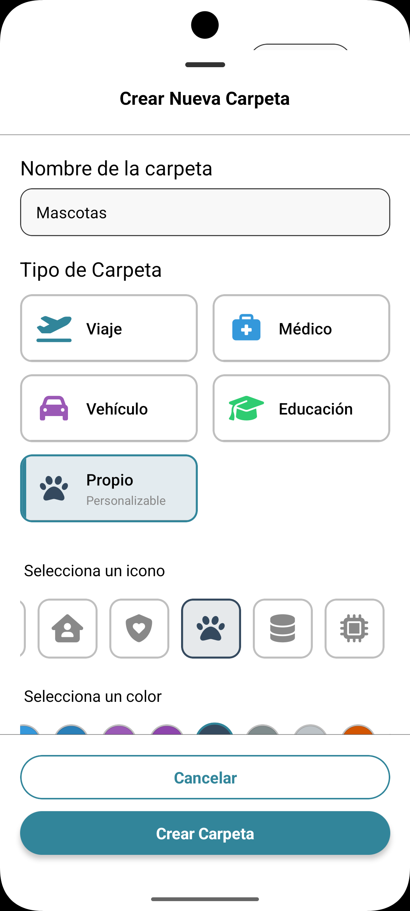
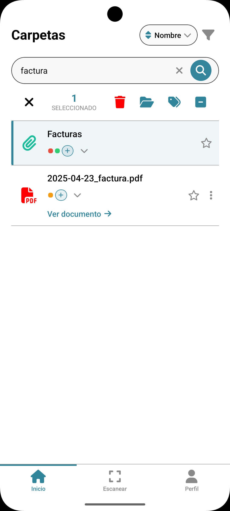

# DocWallet - Tus documentos, siempre contigo.

[](https://github.com/D-Gaspa/doc_wallet/actions/workflows/ci.yml)

<p align="center">
  
</p>

## Project Overview

> [!IMPORTANT]
> Managing personal and governmental documents in Mexico presents significant challenges due to complex procedures, scattered information, and the risk of missing critical expiration dates. DocWallet is a cross-platform mobile application designed to address these issues by providing a secure, centralized platform for digital document management.

Built using React Native and TypeScript, DocWallet enables users to store document copies securely, receive automated expiration alerts, and organize files efficiently using folders and tags. The project followed a hybrid development methodology, combining structured milestones with agile practices like feature branching, continuous integration, and code reviews.

The primary goal is to empower users with better control over their documentation, ensuring timely renewals and easier access to necessary information.

## Features

DocWallet offers a range of features to simplify document management:

* **Secure User Authentication:** Log in using biometric data (fingerprint/face recognition) or a secure PIN.
* **Digital Document Storage & Handling:** Import and store digital copies of your important documents locally and securely.
* **Document Organization:**
    * **Folders:** Create a hierarchical folder structure to organize documents logically.
    * **Tags:** Apply personalized tags (e.g., 'personal', 'work', 'vehicle') for quick filtering and retrieval.
* **Expiration Alerts:** Receive automated notifications for upcoming document expiration dates.
* **Document Scanning:** Easily scan physical documents directly into the app.
* **Multi-Profile Management (Planned)::** Manage document sets for multiple individuals (e.g., family members) within a single account.
* **User-Friendly Interface:** An intuitive and clean UI for easy navigation and management.
* **Light & Dark Mode:** Choose your preferred theme for comfortable viewing.

## Requirements for Execution

> [!NOTE]
> To run this project locally, you will need:
>
> * **Node.js:** Version 18 or higher (`>=18`).
> * **npm** (Node Package Manager) or **Yarn**.
> * **React Native CLI**.
> * **Development Environment:**
>     * **Android Studio** (for Android development) with an emulator or physical device.
>         * Java Development Kit (JDK) version 17 (as per CI workflow).
>     * **Xcode** (for iOS development, macOS only) with an iOS simulator or physical device.
>     * You can also use IDEs like **WebStorm** for development.

## Installation Instructions

1.  **Clone the repository:**
    ```bash
    git clone [https://github.com/D-Gaspa/doc_wallet.git](https://github.com/D-Gaspa/doc_wallet.git)
    cd doc_wallet
    ```

2.  **Install dependencies:**
    ```bash
    npm install
    # OR
    # yarn install
    ```

3.  **For iOS:**

  > [!TIP]
  > If you are on a macOS machine and want to run the iOS version:
  >
  > 1.  Navigate to the `ios` directory: `cd ios`
  > 2.  Install Pods: `pod install`
  > 3.  Navigate back to the root directory: `cd ..`

4.  **Run the application:**
    * **For Android:**
        ```bash
        npm run android:dev
        # OR
        # yarn android:dev
        ```
    * **For iOS:**
        ```bash
        npm run ios:dev
        # OR
        # yarn ios:dev
        ```

## Usage Examples

DocWallet provides an intuitive interface for managing your documents. Here’s a quick look at a possible user flow:

1.  **Navigate and Organize:**
    Upon launching the app and authenticating, you'll see your main folder view. You can browse existing folders and documents. The floating action button (FAB) allows you to quickly add new folders or documents.

2.  **Create a New Folder:**
    Tapping the "Add Folder" option from the FAB opens a modal where you can define the new folder's name, type, and customize its icon and color for easy identification.

3.  **Search and Manage Documents:**
    Use the search bar to quickly find documents or folders. Once you locate an item, you can select it to perform various actions like viewing, editing, tagging, or deleting. The selection mode provides batch operations.

<div align="center">
  <table>
    <tr>
      <td align="center" valign="top">
         <br/>
        <em>Main folder view with options to add items.</em>
      </td>
      <td align="center" valign="top">
         <br/>
        <em>Creating a new custom folder for "Mascotas" (Pets).</em>
      </td>
      <td align="center" valign="top">
         <br/>
        <em>Searching for "factura" (invoice) and selecting a document.</em>
      </td>
    </tr>
  </table>
</div>

## General Component Information

> [!NOTE]
> The project is structured with a clear separation of concerns, primarily within the `src` directory:

* **`src/components`:** Contains reusable UI components, categorized into:
    * `common`: Basic shared components like modals, logos, error boundaries, and loading indicators.
    * `ui`: More specific UI elements like buttons, cards, forms, layout primitives (Container, Row, Stack, Spacer), notification displays, profile headers, and various screen-specific UI components.
    * `ExpandingFab.tsx`: The floating action button for adding documents and folders.
* **`src/config`:** Houses theme configurations (colors, typography, design tokens) and environment variables.
* **`src/context`:** Includes context providers, such as `ThemeContext.tsx` for managing light/dark modes.
* **`src/hooks`:** Custom React hooks for shared logic, like authentication (`useAuth.ts`), form validation (`useFormValidation.ts`), search functionality (`useSearchHistory.ts`, `useSearchSuggestions.ts`), and theme access (`useTheme.ts`).
* **`src/navigation`:** Defines the app's navigation structure using React Navigation, including stack and tab navigators for different sections like Auth, Documents, Profile, and Settings.
* **`src/services`:** Contains business logic and integrations:
    * `auth`: Services for authentication methods like Biometric, Google, PIN, and token management.
    * `document`: Services for document import, preview, and storage.
    * `monitoring`: Services for crash reporting, error tracking, logging, performance monitoring, and security testing.
    * `security`: Includes document encryption services.
    * `settings`: For managing theme settings.
* **`src/store`:** Global state management using Zustand, with stores for authentication, documents, favorite documents, folders, notifications, and tags.
* **`src/types`:** TypeScript type definitions for various entities and structures within the app (auth, config, document, icons, monitoring, navigation, user).
* **`src/utils`:** Utility functions, such as ID generation and ensuring unique titles.
* **`App.tsx`:** The main entry point of the application, setting up providers and root navigation.

## Tech Stack

* **Core Framework:** React Native
* **Programming Language:** TypeScript
* **Navigation:** React Navigation (`@react-navigation/native`, `@react-navigation/bottom-tabs`, `@react-navigation/native-stack`)
* **State Management:** Zustand
* **UI Components:** Custom components, `react-native-svg`, `react-native-vector-icons/fontawesome6`
* **Styling:** React Native StyleSheet, Custom Theme System
* **Local Storage:** `@react-native-async-storage/async-storage`, `react-native-keychain`
* **Document Handling:** `@react-native-documents/picker`, `@react-native-documents/viewer`, `react-native-document-scanner-plugin`
* **Authentication:** `expo-local-authentication`, `react-native-app-auth`, `jwt-decode`
* **Encryption:** `crypto-js`, `react-native-quick-crypto`
* **Development Tooling:** Node.js, npm, ESLint, Prettier, Jest, Husky, `react-native-config`
* **CI/CD:** GitHub Actions

## Project Structure
```
doc_wallet
├── .github/workflows/ci.yml      # Continuous Integration workflow
├── src
│   ├── components                # UI and common components
│   ├── config                    # Theme and environment configuration
│   ├── context                   # React context providers (e.g., ThemeContext)
│   ├── hooks                     # Custom React hooks
│   ├── navigation                # Navigation setup and route definitions
│   ├── services                  # Business logic, API integrations, etc.
│   ├── store                     # Global state management (Zustand)
│   ├── types                     # TypeScript type definitions
│   ├── utils                     # Utility functions
│   ├── App.tsx                   # Main application component
│   └── declarations.d.ts         # TypeScript declaration files
├── .lintstagedrc.yaml            # Lint-staged configuration
├── .prettierrc.yaml              # Prettier configuration
├── app.json                      # Application configuration
├── index.js                      # Entry point for React Native
├── metro.config.js               # Metro bundler configuration
├── package.json                  # Project dependencies and scripts
└── tsconfig.json                 # TypeScript configuration
```
